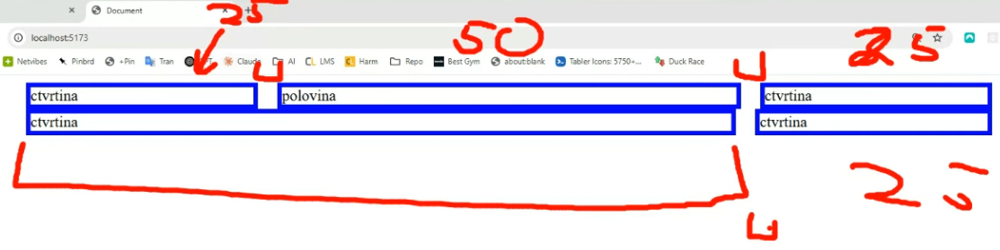
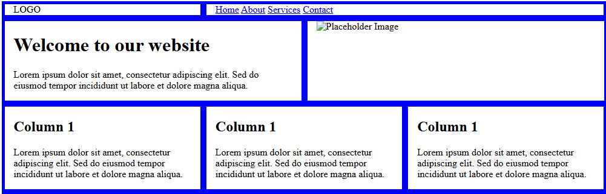

# Media queries, responsive web design, SASS grid

## Media queries

* `@media` queries:
  * "když platí nějaká podmínka, použij nějaké css" - tím můžeme reagovat na šířku viewportu/displeje
  * nebo třeba na to, jestli je to screen nebo print (vytiskne se to jinak, než když je to zobrazené na displeji) - typy medií: all, screen, ~~tv~~, print, projection, speech, braille, ~~embossed~~, ~~handheld~~ (škrtnuté se moc nepoužívají)

  ``` scss
  @media (max-width: 600px) {
    .sidebar {
      display: none;
    }
  }
  ```

* **breakpoint** = hranice, kde se změní layout na základě šířky viewportu (ale to se vztahuje na zásadní změny, chci, aby to bylo flexibilní a responzivní i mezi nimi)

  ```scss
  @media (orientation: portrait) {
  .box background: red;
  }
  ```

* můžu určit layout podle toho, jestli je to na šířku nebo na výšku
když dělám RWD, často se začíná od layoutu pro mobil - tzv. `mobile first` přístup:

  * tedy začíná se od nejjednoduššího designu, a pak přes další a další `@media` queries to rozšiřuju pro větší displeje na složitější design
  * víc než 60% (teď už asi víc) návštěvníků webu přichází z mobilu
  * design pro mobil je mnohem složitější na vymyšlení, musím vymyslet, co bude a nebude vidět, většinou to bude vše pod sebou; nakódovat už je to jednodušší

  ``` scss
  .box {
    border: 2px solid black;
    padding: 20px;
    background: lightblue;
  }

  @media only screen and (max-width: 768px) {
    
    .box {
      background: pink;
    }

    .container {
      display: flex;
      gap: 20px;
    }
  }
  ```

* pořadí kódu je důležitý - mobil bude první, pak přes `@media` budu nabalovat další styly
* všechny hodnoty ze stylu mobilu zůstávají, jen přepisuju některé z nich, případně přidávám
* většinou:
      1. mobil (nejužší zařízení)

      2. tablet (prostřední)

      3. PC (nejširší)

* pokud bych chtěl, aby to nemělo rámeček, tak musím dát `border: none;` - to se pak dědí do následujícího `@media`

* `standard breakpoints`: vznikly na základě nějakýho grafu s průměrnými šířkami

* ve vývojářských nástrojích to můžu vidět, když posunu hranu prohlížeče (uvidím, jak to reaguje na můj design podle šířky)
můžu nestovat `@media` pod elementy - takhle to vypadá na mobilu, tabletu, PC:

  ``` scss
  body {
      background: green;

      @media (min-width: 400px) {
          background: violet;
      }

      @media (min-width: 800px) {
          background: orange;
      }
  }
  ```

* v `@media` query nejde použít nativní css proměnné `:root {}`
můžu ale udělat sass proměnné:

  ``` scss
  $tablet: 400px;

  @media (min-width:$tablet).......
  ```

  * nebo můžu udělat `@mixin`, který budou ty `@media` obsahovat
  opsat si kód od něj - ukazoval před obědem
  pak můžu upravit jen ty `@mixin`s a změní se mi to všude

___

## SCSS Grid

Chceme vytvořit vlastní **grid systém**, podobný např. systému z Bootstrapu.
⚠️ Poroz, neplést s nativním CSS gridem (`display: grid;`).

Jde nám o to, vytvořit si vlastní systém, kde prostor rozdělíme např. na 12 stejně širokých částí.
Budeme vytvářet řádky a sloupce. Šířku jednotlivých sloupců chceme nastavovat tak, že řekneme, kolik 1/12 bude sloupec zabírat.

**Například:**
- šířka 3 = čtvrtina stránky (3/12)
- šířka 4 = třetina stránky (4/12)
- šířka 6 = polovina stránky (6/12)
- atd.

**V CSS bychom to tedy nastavili takto:**
```scss
.col-1  { width: 8.333%;  } // 1 dvanáctina ze 100%
.col-2  { width: 16.666%; } // 2 dvanáctiny ze 100%
.col-3  { width: 25%;     } // 3 dvanáctiny ze 100%
// ...atd.
.col-11 { width: 91.666%; } // 11 dvanáctin ze 100%
.col-12 { width: 100%;    } // 12 dvanáctin ze 100%
```

**Row**
Sloupce mají být na stránce vedle sebe, takže budeme potřebovat sloupce uzavřít do rodiče - budeme mu říkat **řádek**, takže použijeme třídu `.row`. A nastavíme na ni **flexbox**.

Zároveň chceme, aby se sloupec dal na nový řádek, když součet šířky sloupců přesáhne 12. Takže na flexbox zapneme i `wrap`.

```scss
.row {
  display: flex;
  flex-wrap: wrap;
}
```

V HTML by potom použití vypadalo takto:
```html
<div class="container">
  <div class="row">
    <div class="col-3">Čtvrtina stránky</div>
    <div class="col-6">Polovina stránky</div>
    <div class="col-3">Čtvrtina stránky</div>
  </div>
</div>
```

Protože chceme, aby byl náš grid konfigurovatelný (třeba jiný počet sloupců na řádku než 12, mezery mezi sloupci, apod.), vytvoříme ho programově pomocí Sassu:

```scss
@use 'sass:math';

$columns: 12; // tady si nastavuje počet sloupců, do kterých se grid dělí - default je 12, ale můžeš si nastavit kolik chceš
$column-base-width: math.div(100%, $columns);
$gutter: 24px;

.container {
  max-width: 960px;
  margin-inline: auto;
}

.row {
  display: flex;
  flex-wrap: wrap; // aby se případně sloupec, který je tam navíc, posunul dolů na další řádek
}

[class*="col-"] {// vyber všechny prvky, které mají třídu obsahující col-
  min-height: 1px;
  width: 100%;
  padding-inline: math.div($gutter, 2);
}

@for $i from 1 through $columns {
  .col-#{$i} {
    width: $column-base-width * $i;
  }
}
```
- potom můžu v HTML tvořit další řádky v layoutu a klidně jim dát jiné poměry, třeba:

  ``` html
    <div class="row">
      <div class="col-6">polovina</div>
      <div class="col-6">polovina</div>
    </div>
  ```

- obvykle nemáme obsah webu od kraje ke kraji, takže se potom do CSS přidává `container` a v html se to do containeru zabalí:

  ``` scss
  .container {
    max-width: 1000px; // omezení šířky containeru
    margin-inline: auto; // vycentrování containeru
  }
  ```

  ``` html
  <div class="container">
    <div class="row">
      <div class="col-3">ctvrtina</div>
      <div class="col-6">polovina</div>
      <div class="col-3">ctvrtina</div>
    </div>  
  </div>
  ```
- tedy procentuální šířka sloupců nebude procento z šířky celé stránky, ale ze šířky `containeru`, do kterého je grid zabalený

- proč nechci dávat mezeru mezi těmi sloupci pomocí `gap`:
  - flexbox roztáhne každý řádek zvlášť podle počtu prvků a jejich poměrů, a pak nebudou sedět mezery mezi různými řádky vzájemně
  - například takhle to vypadá, když jsem nastavil `gap: 20px`:


- nám reálně nejde o to, aby byla mezera mezi sloupci jako takovými, ale aby obsah, který v nich je, byl oddělený vzájemně - takže můžeme třeba nastavit každému tomu sloupci nějaký `padding`:
  ``` scss
  [class*=col-] { // vyber všechny prvky, které mají třídu obsahující col-
    border: 5px solid blue;
    padding-inline: 20px;
  }
  ```

- akorátže my nebudeme chtít tohle nastavovat napevno, takže to nastavíme přes proměnnou: `$gutter`
  ``` scss
  $gutter: 30px; // mezera mezi sloupci

  [class*=col-] { // vyber všechny prvky, které mají třídu obsahující col-
  border: 5px solid blue;
  padding-inline: math.div($gutter, 2); // padding na levé a pravé straně sloupce
  }
  ```

- často se nastavuje pro sloupec `min-height: 1px;`, aby kdyby náhodou ve sloupci nebyl obsah, aby i tak zabíral místo - ale prý to není tak podstatný

- chci, aby to bylo responzivní:

  ``` scss
  [class*=col-] { // vyber všechny prvky, které mají třídu obsahující col-
    border: 5px solid blue;
    width: 100%;
    padding-inline: math.div($gutter, 2); // padding na levé a pravé straně sloupce
  }

  @media (min-width: 800px) { // určím, od jaké velikosti se mají sloupce vytvořit, na menším displeji budou mít šířku 100% šířky okna a budou pod sebou
    @for $i from 1 through $columns {
      
      .col-#{$i} {
        width: math.div($i * $column-base-width, 1);
      }
    }
  }
  ```
- pak můžu vytvořené třídy použít pro snadné vytvoření basic layoutu v html:

  ``` html
  <div class="container">
    <header class="row">
      <div class=" logo col-4">LOGO</div>

      <div class="menu col-8">
        <a href="#">Home</a>
        <a href="#">About</a>
        <a href="#">Services</a>
        <a href="#">Contact</a>
      </div>  
    </header>

    <div class="banner row">
      <div class="col-6">
        <h1>Welcome to our website</h1>
        <p>Lorem ipsum dolor sit amet, consectetur adipiscing elit. Sed do eiusmod tempor incididunt ut labore et dolore magna aliqua.</p>
      </div>

      <div class="col-6">
        
      </div>
    </div>
    
    <div class="row">
      <div class="col-4">
        <h2>Column 1</h2>
        <p>Lorem ipsum dolor sit amet, consectetur adipiscing elit. Sed do eiusmod tempor incididunt ut labore et dolore magna aliqua.</p>
      </div>

      <div class="col-4">
        <h2>Column 1</h2>
        <p>Lorem ipsum dolor sit amet, consectetur adipiscing elit. Sed do eiusmod tempor incididunt ut labore et dolore magna aliqua.</p>
      </div>

      <div class="col-4">
        <h2>Column 1</h2>
        <p>Lorem ipsum dolor sit amet, consectetur adipiscing elit. Sed do eiusmod tempor incididunt ut labore et dolore magna aliqua.</p>
      </div>   
  </div>
  ```
  - potom výsledek:
  

- výhoda je, že je to potom rychlejší, udělat layout - 80% webů to používá
  - ale v lecčems je CSS grid lepší